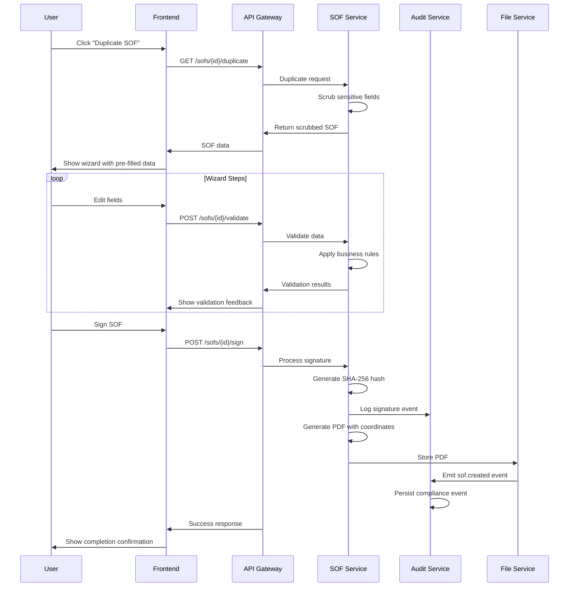

# System Architecture

## High-Level C4 Architecture

```
 Customer ──▶  Front-End (React+Next.js)
              ┃
              ▼
           API-Gateway (FastAPI)
              ┣━━ auth-svc (JWT/OAuth2)
              ┣━━ sof-svc (business rules, PDF)
              ┣━━ file-svc (S3-compatible)
              ┗━━ audit-svc (EventStoreDB)
 
 Database: Postgres (PPS, users, orders)
 Storage : S3 (PDF, signature blobs)
```

## Service Architecture

### Frontend (React + Next.js)
- **Purpose**: User interface for SOF wizard workflow
- **Key Features**: 8-step wizard, real-time validation, signature capture
- **Technology**: React 18, Next.js 14, TypeScript, Tailwind CSS

### API Gateway (FastAPI)
- **Purpose**: Central routing and request handling
- **Key Features**: Request validation, rate limiting, CORS handling
- **Technology**: FastAPI, Python 3.11, Pydantic v2

### Auth Service
- **Purpose**: Authentication and authorization
- **Key Features**: JWT tokens, OAuth2, role-based access
- **Technology**: FastAPI, JWT, bcrypt

### SOF Service  
- **Purpose**: Core business logic and PDF generation
- **Key Features**: Business rule validation, PDF templating, dose calculations
- **Technology**: FastAPI, pdf-lib (Node.js), Jinja2 templates

### File Service
- **Purpose**: Document storage and retrieval
- **Key Features**: S3-compatible storage, presigned URLs, lifecycle management
- **Technology**: FastAPI, boto3, MinIO/S3

### Audit Service
- **Purpose**: Compliance logging and event sourcing
- **Key Features**: Event store, audit trails, Part 11 compliance
- **Technology**: EventStoreDB, FastAPI

## Critical Sequence Diagrams

### Duplicate → Edit → Sign Flow



## Data Flow Architecture

### Request Flow
1. **Frontend** → API Gateway (request validation)
2. **API Gateway** → Service routing based on endpoint
3. **Services** → Postgres for transactional data
4. **Services** → S3 for file storage
5. **All Services** → Audit Service for compliance logging

### Event Flow
1. **SOF Service** emits business events
2. **Audit Service** consumes events for compliance
3. **File Service** emits storage events
4. **Notification Service** (future) consumes events for alerts

## Technology Stack

### Backend
- **API Framework**: FastAPI (Python 3.11)
- **Database**: PostgreSQL 15
- **Event Store**: EventStoreDB
- **File Storage**: S3-compatible (MinIO/AWS S3)
- **Cache**: Redis
- **Message Queue**: RabbitMQ (future)

### Frontend
- **Framework**: Next.js 14 (React 18)
- **Language**: TypeScript
- **Styling**: Tailwind CSS
- **State Management**: Zustand
- **Form Handling**: React Hook Form + Zod

### Infrastructure
- **Container**: Docker + Docker Compose
- **Orchestration**: Kubernetes (production)
- **Cloud**: GCP Cloud Run
- **Monitoring**: OpenTelemetry + Grafana
- **CI/CD**: GitHub Actions

## Deployment Architecture

### Development
```
docker-compose.yml
├── frontend (Next.js dev server)
├── api-gateway (FastAPI with reload)
├── postgres (local instance)
├── redis (local instance)
└── minio (S3-compatible local storage)
```

### Production (GCP)
```
Cloud Run Services:
├── frontend (containerized Next.js)
├── api-gateway (FastAPI production)
├── sof-service (FastAPI)
├── auth-service (FastAPI)
├── file-service (FastAPI)
└── audit-service (FastAPI)

Managed Services:
├── Cloud SQL (PostgreSQL)
├── Cloud Storage (file storage)
├── Cloud Memorystore (Redis)
└── Cloud Monitoring (observability)
```
